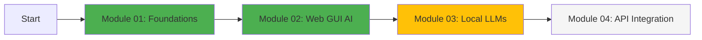

<div align="center">

# 🎮 Interactive Learning Hub


*Transform theoretical knowledge into practical skills through hands-on interactive experiences*

</div>

---

## 🎯 What's Inside

This directory contains all interactive learning components designed to enhance your training experience:

```
interactive/
├── quizzes/              # Interactive knowledge checks with instant feedback
├── labs/                 # Step-by-step guided lab exercises
├── exercises/            # Coding challenges and practice problems
├── challenges/           # Advanced scenarios and CTF-style challenges
├── progress-tracking/    # Your learning journey visualization
└── visualizations/       # Interactive diagrams and flowcharts
```

---

## 🚀 Quick Start

### Option 1: Web-Based Interactive Mode (Recommended)

```bash
# Clone the repository
git clone https://github.com/consigcody94/FWG-LLM-Agentic-Training-Guide.git
cd FWG-LLM-Agentic-Training-Guide

# Install interactive environment
pip install -r interactive/requirements.txt

# Launch interactive dashboard
python interactive/dashboard.py
```

Then open http://localhost:8888 in your browser to access:
- 📊 Progress Dashboard
- 🎯 Interactive Quizzes
- 💻 Code Playgrounds
- 🏆 Achievement Badges
- 📈 Skill Tree Visualization

### Option 2: CLI-Based Interactive Mode

```bash
# Run individual interactive quizzes
python interactive/quizzes/run_quiz.py --module 01

# Launch code challenges
python interactive/challenges/challenge_runner.py

# Check your progress
python interactive/progress-tracking/show_progress.py
```

---

## 🎓 Learning Features

### 1. Interactive Quizzes

Each module comes with:
- **Multiple Choice Questions** with instant feedback
- **Code Completion Challenges** with real-time validation
- **Scenario-Based Questions** using real federal use cases
- **Adaptive Difficulty** that adjusts to your performance

**Example:**
```bash
cd interactive/quizzes
python quiz_module01.py
```

### 2. Hands-On Labs

Step-by-step guided experiences with:
- **Checkpoint Validation** - automatic verification of each step
- **Hints System** - progressive hints if you get stuck
- **Solution Walkthroughs** - detailed explanations
- **Time Tracking** - see how quickly you're progressing

### 3. Code Playgrounds

Interactive coding environments featuring:
- **Live Code Execution** - run Python/JavaScript directly
- **Pre-configured APIs** - test OpenAI, Claude, Ollama without setup
- **Sandbox Environments** - safe experimentation space
- **Example Gallery** - copy and modify working examples

### 4. Achievement System

Track your progress with:
```
🥉 Bronze Badge - Complete module reading + quiz (50%)
🥈 Silver Badge - Complete hands-on labs (75%)
🥇 Gold Badge - Complete all challenges (100%)
💎 Diamond Badge - Achieve mastery across all modules

Special Badges:
🔐 Security Expert - Complete all security modules
🤖 Agent Master - Build a multi-agent system
🏛️ Federal Compliance Pro - Pass all governance assessments
```

### 5. Progress Visualization

Your learning journey visualized:



Legend:
- 🟢 Green = Completed with Gold Badge
- 🟡 Yellow = In Progress
- ⚪ Gray = Not Started
- 🔵 Blue = Currently Active

---

## 📁 Directory Structure

### Quizzes (`/quizzes`)

```
quizzes/
├── quiz_module01.py          # LLM Foundations quiz
├── quiz_module02.py          # Web GUI AI quiz
├── quiz_module05.py          # Prompt Engineering quiz
├── quiz_module06.py          # MCP Protocol quiz
├── quiz_module12.py          # Multi-Agent Systems quiz
├── quiz_module19.py          # Security & Governance quiz
├── run_quiz.py               # Universal quiz runner
└── quiz_data/                # Question banks in JSON format
    ├── foundations.json
    ├── prompt_engineering.json
    └── security.json
```

### Labs (`/labs`)

```
labs/
├── lab00_hello_agent/
│   ├── README.md             # Lab instructions
│   ├── starter_code.py       # Starting point
│   ├── solution.py           # Reference solution
│   └── validator.py          # Auto-grader
├── lab05_mcp_server/
│   ├── README.md
│   ├── template/             # Starter template
│   ├── checkpoints/          # Validation scripts
│   └── complete_solution/    # Fully working example
└── lab_runner.py             # Interactive lab launcher
```

### Exercises (`/exercises`)

```
exercises/
├── 01_tokenization/
│   ├── exercise.md           # Problem description
│   ├── test_cases.json       # Expected outputs
│   └── hints.md              # Progressive hints
├── 02_prompt_optimization/
├── 03_rag_implementation/
└── exercise_validator.py     # Automated testing
```

### Challenges (`/challenges`)

```
challenges/
├── ctf_prompt_injection/     # Capture The Flag: Prompt Security
├── agent_optimization/        # Optimize multi-agent performance
├── cost_reduction/           # Reduce API costs by 50%
└── compliance_audit/         # Build a compliance checker
```

---

## 🎮 Gamification System

### XP (Experience Points)

Earn XP for every learning activity:

| Activity | XP Earned |
|:---------|:----------|
| Read module documentation | 10 XP |
| Complete quiz (Bronze) | 25 XP |
| Finish hands-on lab (Silver) | 50 XP |
| Solve challenge (Gold) | 100 XP |
| Contribute to repository | 200 XP |
| Help fellow learner | 50 XP |

### Levels

```
Level 1:  Novice          (0-100 XP)     🌱
Level 2:  Apprentice      (101-300 XP)   🌿
Level 3:  Practitioner    (301-600 XP)   🌳
Level 4:  Expert          (601-1000 XP)  🏆
Level 5:  Master          (1001-1500 XP) ⭐
Level 6:  AI Architect    (1501-2500 XP) 👑
Level 7:  Federal AI Lead (2501+ XP)     💎
```

### Leaderboard

Track your ranking among peers (optional, privacy-respecting):

```bash
python interactive/progress-tracking/leaderboard.py
```

**Note**: Participation is voluntary and doesn't affect certification.

---

## 💻 Technical Requirements

### Minimum Requirements

```yaml
Software:
  - Python: 3.11+
  - Node.js: 18+ (for JavaScript exercises)
  - Git: 2.x

System:
  - RAM: 8GB minimum (16GB recommended)
  - Storage: 10GB free space
  - Internet: Broadband connection

Optional:
  - Docker: For containerized labs
  - GPU: For local LLM exercises (Module 03)
```

### Installation

```bash
# Navigate to interactive directory
cd interactive

# Create virtual environment
python3 -m venv venv
source venv/bin/activate  # Windows: venv\Scripts\activate

# Install dependencies
pip install -r requirements.txt

# Verify installation
python verify_setup.py
```

Expected output:
```
✅ Python 3.11.x detected
✅ All required packages installed
✅ Quiz system ready
✅ Lab environment configured
✅ Progress tracking initialized

🎉 Interactive learning environment ready!
Run: python dashboard.py
```

---

## 📊 Usage Examples

### Example 1: Take a Quiz

```bash
$ python quizzes/run_quiz.py --module 01

╔══════════════════════════════════════════════╗
║   LLM Foundations - Interactive Quiz         ║
╚══════════════════════════════════════════════╝

Question 1 of 10:

What is the primary innovation of the Transformer architecture?

A) Recurrent connections for sequential processing
B) Self-attention mechanism for parallel processing
C) Convolutional layers for pattern recognition
D) Reinforcement learning for optimization

Your answer: B

✅ Correct!
Explanation: The Transformer architecture introduced self-attention,
allowing parallel processing of entire sequences rather than
sequential token-by-token processing.

+10 XP | Score: 1/1 | Progress: 10%
```

### Example 2: Start a Lab

```bash
$ python labs/lab_runner.py --lab 05

╔══════════════════════════════════════════════╗
║   Lab 05: Build Your First MCP Server        ║
╚══════════════════════════════════════════════╝

📋 Objectives:
  - Understand MCP protocol architecture
  - Implement resource providers
  - Create tool definitions
  - Test with Claude Code

⏱️  Estimated time: 90 minutes
🏆 Reward: 50 XP + Silver Badge

▶️  Ready to start? (y/n): y

Checkpoint 1/5: Project Setup
─────────────────────────────
Task: Create project directory and install MCP SDK

Run: mkdir my-mcp-server && cd my-mcp-server
     npm init -y
     npm install @modelcontextprotocol/sdk

Type 'done' when complete: done

Validating... ✅ Project structure correct!

+10 XP | Next checkpoint unlocked
```

### Example 3: Check Progress

```bash
$ python progress-tracking/show_progress.py

╔══════════════════════════════════════════════════════════════╗
║              YOUR LEARNING PROGRESS                          ║
╠══════════════════════════════════════════════════════════════╣
║                                                              ║
║  Level: 3 - Practitioner                                    ║
║  Total XP: 485 / 600 (Next level: 115 XP needed)           ║
║  ████████████████░░░░░░░░ 81%                               ║
║                                                              ║
║  Modules Completed: 5 / 27                                  ║
║  Badges Earned: 8                                           ║
║  Current Streak: 7 days 🔥                                   ║
║                                                              ║
╠══════════════════════════════════════════════════════════════╣
║  RECENT ACHIEVEMENTS                                         ║
╠══════════════════════════════════════════════════════════════╣
║                                                              ║
║  🥇 Gold Badge: Module 01 - LLM Foundations                  ║
║  🥈 Silver Badge: Module 04 - API Integration                ║
║  🏆 Special: Prompt Engineering Expert                       ║
║                                                              ║
╠══════════════════════════════════════════════════════════════╣
║  NEXT RECOMMENDED                                            ║
╠══════════════════════════════════════════════════════════════╣
║                                                              ║
║  📘 Module 06: MCP Protocol (0% complete)                    ║
║     Estimated time: 6 hours                                  ║
║     → Start now: python interactive/start_module.py 06       ║
║                                                              ║
╚══════════════════════════════════════════════════════════════╝
```

---

## 🏗️ Building Your Own Interactive Content

Want to add your own exercises or quizzes? Here's how:

### Create a New Quiz

```python
# interactive/quizzes/my_custom_quiz.py

from quiz_framework import Quiz, MultipleChoice, CodeChallenge

quiz = Quiz(
    title="Custom MCP Server Quiz",
    module="06",
    difficulty="intermediate",
    time_limit=20  # minutes
)

quiz.add_question(MultipleChoice(
    question="What transport protocol does MCP use?",
    options=[
        "HTTP",
        "JSON-RPC 2.0",
        "gRPC",
        "WebSocket"
    ],
    correct=1,  # Index of correct answer
    explanation="MCP uses JSON-RPC 2.0 over stdio or HTTP+SSE",
    points=10,
    reference="modules/06-mcp-protocol/README.md#transport"
))

quiz.add_question(CodeChallenge(
    description="Implement a simple MCP tool definition",
    starter_code='''
def create_tool_definition():
    # TODO: Return a valid tool definition dict
    pass
''',
    test_cases=[
        {"input": None, "expected": {"name": str, "description": str}},
    ],
    points=25
))

if __name__ == "__main__":
    quiz.run()
```

### Create a New Lab

```markdown
<!-- interactive/labs/lab_custom/README.md -->

# Lab: Build a Custom AI Agent

## Overview
Build a specialized AI agent for federal document classification.

## Prerequisites
- Module 01: Foundations (completed)
- Module 04: API Integration (completed)
- Module 08: Agent Frameworks (completed)

## Learning Objectives
- [ ] Design an agent architecture
- [ ] Implement tool calling
- [ ] Add safety guardrails
- [ ] Test with real documents

## Checkpoints

### Checkpoint 1: Setup (15 min)
**Objective**: Initialize project and install dependencies

```bash
# Create project
mkdir federal-doc-classifier
cd federal-doc-classifier

# Install requirements
pip install openai langchain chromadb
```

**Validation**: Run `python -c "import langchain; print('✅')"`

### Checkpoint 2: Build Classifier (30 min)
**Objective**: Implement the classification logic

... (detailed instructions)

**Validation**: Run `python validator.py checkpoint2`

## Solution
A complete reference implementation is available in `solution/`
```

---

## 🤝 Contributing

Help us make the interactive experience even better!

### Ways to Contribute

1. **Report Issues**: Found a bug in a quiz? Lab not working? [Open an issue](../../issues)

2. **Add Exercises**: Create new coding challenges
   ```bash
   cd interactive/exercises
   cp -r template/ my_new_exercise/
   # Edit and submit PR
   ```

3. **Improve Labs**: Enhance existing lab instructions
4. **Create Visualizations**: Add interactive diagrams
5. **Share Solutions**: Contribute alternative solutions to challenges

### Contribution Guidelines

```bash
# Fork repository
# Create feature branch
git checkout -b feature/new-quiz-module-10

# Make your changes
# Test thoroughly
python test_interactive_component.py

# Submit pull request
```

---

## 📞 Support

### Getting Help

1. **Documentation**: Check the main [README](../../README.md)
2. **FAQ**: See [troubleshooting guide](../../appendices/C-troubleshooting.md)
3. **Issues**: Search [existing issues](../../issues)
4. **Discussions**: Join [community discussions](../../discussions)

### Common Issues

<details>
<summary><b>Quiz won't start - ModuleNotFoundError</b></summary>

```bash
# Make sure you're in the correct directory
cd interactive

# Activate virtual environment
source venv/bin/activate

# Reinstall dependencies
pip install -r requirements.txt
```

</details>

<details>
<summary><b>Progress not saving</b></summary>

Check permissions on `progress-tracking/.progress.db`:
```bash
chmod 644 progress-tracking/.progress.db
```

Or reset progress:
```bash
python progress-tracking/reset_progress.py
```

</details>

<details>
<summary><b>Lab validation failing incorrectly</b></summary>

Try running the validator in verbose mode:
```bash
python labs/validator.py --verbose --checkpoint 3
```

</details>

---

## 📜 License

All interactive content follows the same license as the main repository.

---

<div align="center">

**🎓 Transform Learning into Mastery**

[🎮 Start Interactive Mode](dashboard.py) · [📊 View Progress](progress-tracking/show_progress.py) · [🏆 Achievements](progress-tracking/badges.py)

<br/>

[⬆ Back to Main README](../../README.md)

</div>
