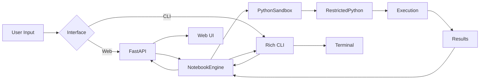

# FWG Training - Live Code Execution Sandbox

<div align="center">

**Jupyter-style notebook environment for interactive federal AI training**


</div>

---

## 🎯 Overview

The FWG Training Code Sandbox is a secure, browser-based and CLI code execution environment that brings Jupyter notebook functionality to federal AI training. Students can write, execute, and experiment with Python code in a safe, isolated environment.

### Key Features

✅ **Secure Sandboxed Execution**
- RestrictedPython integration for code safety
- Resource limits (CPU, memory, time)
- Blocked dangerous modules and functions
- No file system or network access

✅ **Cell-Based Execution**
- Jupyter-style code cells
- Markdown cells for documentation
- Sequential or individual execution
- Persistent namespace between cells

✅ **Dual Interface**
- **Web UI**: Beautiful browser-based interface
- **CLI**: Terminal-based for quick experimentation

✅ **Real-Time Features**
- Live code execution
- Instant output display
- Variable inspection
- Execution timing

✅ **Notebook Management**
- Save/load notebooks
- Export to JSON
- Share with others
- Auto-save capability

---

## 🚀 Quick Start

### Installation

```bash
# Navigate to code-sandbox directory
cd interactive/code-sandbox

# Install dependencies
pip install -r requirements.txt

# For full functionality (optional but recommended)
pip install RestrictedPython fastapi uvicorn websockets
```

### Web Interface

```bash
# Start the web server
python web_interface.py

# Or specify custom port
python web_interface.py --port 8080

# Open browser to: http://localhost:8000
```

### CLI Interface

```bash
# Start interactive CLI
python cli_interface.py

# Load specific notebook
python cli_interface.py --file my_notebook.json

# Run demo
python cli_interface.py --demo
```

---

## 📖 Usage Guide

### Web Interface

<details>
<summary><b>Creating Your First Notebook</b></summary>

1. **Open the web interface** at `http://localhost:8000`
2. **Click "New"** to create a new notebook
3. **Type code** in the first cell:
   ```python
   message = "Hello from FWG Training!"
   print(message)
   ```
4. **Press Shift+Enter** to execute
5. **See output** appear below the cell
6. **Click "+ Add Code Cell"** to continue

</details>

<details>
<summary><b>Keyboard Shortcuts</b></summary>

- **Shift+Enter**: Execute current cell
- **Ctrl+S**: Save notebook (browser)
- **Escape**: Deselect cell

</details>

<details>
<summary><b>Managing Notebooks</b></summary>

**Save Notebook**:
```
Click "Save" button → Saved to notebooks/ directory
```

**Load Notebook**:
```
Click "Load" → Select from list → Opens in interface
```

**Clear Outputs**:
```
Click "Clear All" → Removes all cell outputs
```

**Execute All**:
```
Click "Run All" → Executes cells sequentially
```

</details>

### CLI Interface

<details>
<summary><b>CLI Commands</b></summary>

```
Available Commands:

new      - Create a new notebook
load     - Load an existing notebook
list     - List all notebooks
add      - Add a new cell
edit     - Edit a cell
run      - Execute a cell
runall   - Execute all cells
show     - Show notebook contents
vars     - Display variables in memory
clear    - Clear all outputs
reset    - Reset sandbox environment
save     - Save current notebook
export   - Export notebook to file
help     - Show this menu
exit     - Exit the application
```

</details>

<details>
<summary><b>Example CLI Session</b></summary>

```bash
$ python cli_interface.py

🏛️ FWG Training - Code Sandbox CLI
====================================

sandbox> new
Notebook title [Untitled Notebook]: My First Notebook
✅ Created notebook: My First Notebook

sandbox> add
Cell type (code/markdown) [code]: code
Enter cell content (press Enter twice to finish):
numbers = [1, 2, 3, 4, 5]
squared = [n**2 for n in numbers]
print(f"Original: {numbers}")
print(f"Squared: {squared}")

✅ Added code cell

sandbox> run
▶️  Executing cell 1...

SUCCESS
Time: 0.0023s

Output:
Original: [1, 2, 3, 4, 5]
Squared: [1, 4, 9, 16, 25]

sandbox> vars

📊 Variables in Memory:
  numbers (list) = [1, 2, 3, 4, 5]
  squared (list) = [1, 4, 9, 16, 25]

sandbox> save
✅ Notebook saved: My First Notebook

sandbox> exit
👋 Goodbye!
```

</details>

---

## 🔒 Security Features

The sandbox implements multiple layers of security:

### 1. Code Validation

```python
# Blocked patterns:
- import os, subprocess, sys
- eval(), exec(), compile()
- __import__()
- open(), file()
- socket, urllib, requests
- Dangerous AST nodes
```

### 2. Resource Limits

```python
# Maximum limits:
MAX_EXECUTION_TIME = 30 seconds
MAX_MEMORY_MB = 512 MB
MAX_CPU_TIME = 30 seconds
MAX_FILE_SIZE = 10 MB
```

### 3. Restricted Execution

Using RestrictedPython for safe code execution:
- Limited built-in functions
- No file system access
- No network access
- No subprocess spawning

### 4. Safe Built-ins Only

```python
SAFE_BUILTINS = {
    'abs', 'all', 'any', 'bin', 'bool', 'chr', 'dict',
    'enumerate', 'filter', 'float', 'int', 'len', 'list',
    'map', 'max', 'min', 'print', 'range', 'sorted', 'str',
    'sum', 'tuple', 'type', 'zip'
    # ... and more safe functions
}
```

---

## 📚 Example Notebooks

### Example 1: Federal Data Processing

```python
# Cell 1: Import and setup
from datetime import datetime

# Cell 2: Process federal employee data
employees = [
    {"name": "Alice", "dept": "USDS", "clearance": "Secret"},
    {"name": "Bob", "dept": "GSA", "clearance": "Top Secret"},
    {"name": "Carol", "dept": "DOD", "clearance": "Secret"}
]

# Cell 3: Filter by clearance
top_secret = [e for e in employees if e["clearance"] == "Top Secret"]
print(f"Employees with Top Secret clearance: {len(top_secret)}")

# Cell 4: Generate report
for emp in top_secret:
    print(f"Name: {emp['name']}, Dept: {emp['dept']}")
```

### Example 2: AI Model Token Counting

```python
# Cell 1: Token estimation function
def estimate_tokens(text):
    """Rough estimation: ~4 chars per token"""
    return len(text) // 4

# Cell 2: Test with federal text
text = """
CLASSIFICATION: UNCLASSIFIED//FOR OFFICIAL USE ONLY (FOUO)
Subject: AI Implementation Guidelines
This document outlines the requirements for deploying
artificial intelligence systems in federal environments.
"""

tokens = estimate_tokens(text)
print(f"Estimated tokens: {tokens}")
print(f"At $0.03/1K tokens: ${tokens * 0.03 / 1000:.4f}")

# Cell 3: Calculate budget
documents_per_day = 100
tokens_per_doc = 500
cost_per_1k = 0.03

daily_cost = (documents_per_day * tokens_per_doc * cost_per_1k) / 1000
monthly_cost = daily_cost * 30

print(f"Daily cost: ${daily_cost:.2f}")
print(f"Monthly cost: ${monthly_cost:.2f}")
```

### Example 3: Prompt Engineering Practice

```python
# Cell 1: Define a prompt template
def create_prompt(role, task, context=""):
    template = f"""
You are a {role}.

Task: {task}

{context}

Please provide a detailed response following federal guidelines.
"""
    return template.strip()

# Cell 2: Generate prompts
prompt1 = create_prompt(
    role="federal AI security analyst",
    task="Review this code for security vulnerabilities",
    context="Code handles classified information"
)

print(prompt1)
print(f"\nTokens: ~{len(prompt1) // 4}")

# Cell 3: Test different parameters
roles = ["compliance officer", "data scientist", "policy advisor"]
for role in roles:
    p = create_prompt(role, "Summarize AI governance requirements")
    print(f"{role}: {len(p) // 4} tokens")
```

---

## 🛠️ Technical Architecture

### Components

```
code-sandbox/
├── sandbox_engine.py       # Core execution engine
│   ├── PythonSandbox      # Secure Python execution
│   ├── SecurityConfig     # Security settings
│   ├── NotebookEngine     # Notebook management
│   └── Cell/Notebook      # Data models
│
├── web_interface.py       # FastAPI web application
│   ├── REST API           # Notebook operations
│   ├── WebSocket          # Real-time updates
│   └── HTML/JS UI         # Browser interface
│
├── cli_interface.py       # Terminal interface
│   ├── Rich UI            # Beautiful CLI output
│   └── Interactive REPL   # Command processing
│
└── notebooks/             # Saved notebooks (JSON)
    └── *.json
```

### Data Flow



### Execution Flow

1. **User writes code** in cell
2. **Code validated** for security issues
3. **Resource limits** set (memory, CPU, time)
4. **Code compiled** with RestrictedPython
5. **Execution** in isolated namespace
6. **Output captured** (stdout, stderr, return value)
7. **Results returned** to user interface
8. **Variables persisted** in namespace

---

## 🎓 Learning Exercises

### Beginner Exercises

<details>
<summary><b>Exercise 1: Variables and Types</b></summary>

Create a notebook that:
1. Declares variables of different types (int, str, list, dict)
2. Prints each variable with its type
3. Performs basic operations on each

**Solution**:
```python
# Integer
age = 35
print(f"age ({type(age).__name__}): {age}")

# String
name = "Federal Employee"
print(f"name ({type(name).__name__}): {name}")

# List
departments = ["DOD", "GSA", "USDS"]
print(f"departments ({type(departments).__name__}): {departments}")

# Dictionary
clearance = {"level": "Secret", "expires": "2025-12-31"}
print(f"clearance ({type(clearance).__name__}): {clearance}")
```

</details>

<details>
<summary><b>Exercise 2: Functions</b></summary>

Write a function that:
1. Takes a classification level as input
2. Returns whether it's valid (UNCLASSIFIED, CONFIDENTIAL, SECRET, TOP SECRET)
3. Tests it with different inputs

**Solution**:
```python
def is_valid_classification(level):
    valid_levels = ["UNCLASSIFIED", "CONFIDENTIAL", "SECRET", "TOP SECRET"]
    return level.upper() in valid_levels

# Test
test_cases = ["Secret", "PUBLIC", "Top Secret", "Invalid"]
for case in test_cases:
    result = is_valid_classification(case)
    print(f"{case}: {'✅ Valid' if result else '❌ Invalid'}")
```

</details>

### Intermediate Exercises

<details>
<summary><b>Exercise 3: Data Processing</b></summary>

Process a list of federal contracts:
1. Calculate total value
2. Find highest value contract
3. Group by department

**Solution**:
```python
contracts = [
    {"dept": "DOD", "value": 1000000, "type": "Software"},
    {"dept": "GSA", "value": 500000, "type": "Hardware"},
    {"dept": "DOD", "value": 2000000, "type": "Services"},
    {"dept": "USDS", "value": 750000, "type": "Software"}
]

# Total value
total = sum(c["value"] for c in contracts)
print(f"Total value: ${total:,}")

# Highest value
highest = max(contracts, key=lambda x: x["value"])
print(f"Highest: {highest['dept']} - ${highest['value']:,}")

# Group by department
from collections import defaultdict
by_dept = defaultdict(list)
for contract in contracts:
    by_dept[contract["dept"]].append(contract)

for dept, dept_contracts in by_dept.items():
    dept_total = sum(c["value"] for c in dept_contracts)
    print(f"{dept}: {len(dept_contracts)} contracts, ${dept_total:,}")
```

</details>

### Advanced Exercises

<details>
<summary><b>Exercise 4: AI Cost Calculator</b></summary>

Build a comprehensive AI cost calculator that:
1. Estimates tokens for different text types
2. Calculates costs for multiple models
3. Compares cloud vs. local deployment
4. Generates monthly budget report

**Solution**: See `examples/advanced_cost_calculator.ipynb`

</details>

---

## 🔧 Troubleshooting

### Common Issues

**Issue: "RestrictedPython not installed" warning**
```bash
# Solution:
pip install RestrictedPython
```

**Issue: "FastAPI not installed" for web interface**
```bash
# Solution:
pip install fastapi uvicorn websockets
```

**Issue: Code execution times out**
```python
# Solution: Reduce complexity or increase timeout
# In SecurityConfig:
MAX_EXECUTION_TIME = 60  # Increase to 60 seconds
```

**Issue: Memory limit exceeded**
```python
# Solution: Reduce data size or increase limit
# In SecurityConfig:
MAX_MEMORY_MB = 1024  # Increase to 1GB
```

**Issue: Can't save notebooks**
```bash
# Solution: Check permissions
chmod +w interactive/code-sandbox/notebooks/
```

### Debug Mode

Enable verbose logging:

```python
import logging
logging.basicConfig(level=logging.DEBUG)
```

---

## 🎯 Best Practices

### For Students

1. **Start simple**: Begin with basic Python before complex algorithms
2. **Use print statements**: Debug by printing intermediate values
3. **Save frequently**: Don't lose your work!
4. **Experiment**: The sandbox is safe - try things!
5. **Check variables**: Use the variables panel to inspect state

### For Instructors

1. **Provide templates**: Give students starter notebooks
2. **Set clear goals**: Each notebook should have learning objectives
3. **Use markdown cells**: Document what each section does
4. **Review outputs**: Check student notebooks for understanding
5. **Share examples**: Build a library of good notebooks

### Security Guidelines

1. **Don't bypass security**: The restrictions are there for a reason
2. **Report issues**: If you find a security problem, report it
3. **No sensitive data**: Don't process classified information
4. **Use test data**: Create mock federal data for exercises
5. **Verify inputs**: Always validate user-provided data

---

## 📊 Performance

Typical performance metrics:

- **Code execution**: < 50ms for simple operations
- **Notebook load**: < 100ms
- **Cell add/delete**: < 10ms
- **Variable inspection**: < 5ms
- **Notebook save**: < 50ms

Resource usage:
- **Memory**: ~50MB base + execution overhead
- **CPU**: Minimal when idle, capped during execution
- **Disk**: ~1KB per saved cell

---

## 🚀 Future Enhancements

Planned features:

- [ ] **Multiple language support**: JavaScript, SQL, Bash
- [ ] **Collaborative editing**: Real-time multi-user notebooks
- [ ] **Cell versioning**: Track changes to individual cells
- [ ] **Export formats**: PDF, HTML, Python scripts
- [ ] **Integration with progress tracker**: Earn XP for completing exercises
- [ ] **AI code suggestions**: Claude-powered code completion
- [ ] **Debugging tools**: Step-through execution, breakpoints
- [ ] **Performance profiling**: Identify bottlenecks
- [ ] **Package management**: Install safe pip packages
- [ ] **Git integration**: Version control for notebooks

---

## 📚 Resources

- [Jupyter Documentation](https://jupyter.org/documentation)
- [RestrictedPython Docs](https://restrictedpython.readthedocs.io/)
- [FastAPI Documentation](https://fastapi.tiangolo.com/)
- [Python Security Best Practices](https://python.readthedocs.io/en/stable/library/security_warnings.html)

---

<div align="center">

**🏛️ Federal Working Group - Excellence in Interactive Learning**

*Making AI training hands-on, secure, and effective*

[↩️ Back to Interactive Hub](../README.md) | [🏠 Main README](../../README.md)

</div>
