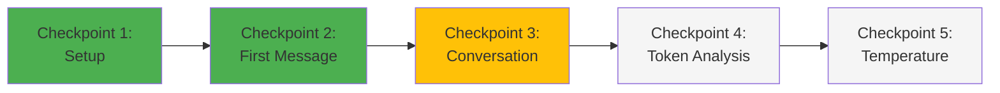

# Lab 00: Hello Agent - Your First AI Interaction

<div align="center">


**Your first hands-on experience with Large Language Models**

</div>

---

## 🎯 Learning Objectives

By completing this lab, you will:

- ✅ Successfully connect to a local LLM using Ollama
- ✅ Understand the basic request-response pattern
- ✅ Observe token-based processing in action
- ✅ Learn to analyze model outputs
- ✅ Gain confidence in AI interaction

---

## 📋 Prerequisites

Before starting this lab, ensure you have:

- [ ] **Ollama installed** - [Installation Guide](../../../README.md#step-2-ai-cli-tools)
- [ ] **Python 3.11+** installed and working
- [ ] **Basic Python knowledge** (variables, functions, print statements)
- [ ] **At least one Ollama model downloaded** (we'll use `llama3.2`)

### Quick Setup Check

Run these commands to verify your environment:

```bash
# Check Python version
python3 --version
# Expected: Python 3.11.x or higher

# Check Ollama is running
ollama list
# Expected: List of downloaded models

# If you don't have llama3.2, download it (2GB)
ollama pull llama3.2
```

If all checks pass, you're ready to begin! 🚀

---

## 🔬 Lab Structure

This lab consists of 5 progressive checkpoints:



**Estimated time**: 15 minutes total (3 minutes per checkpoint)

---

## 📝 Checkpoint 1: Project Setup (3 minutes)

### Objective
Create your workspace and verify connectivity to Ollama.

### Steps

1. **Create project directory**:
   ```bash
   mkdir -p ~/fwg-training/lab00-hello-agent
   cd ~/fwg-training/lab00-hello-agent
   ```

2. **Create a Python virtual environment** (optional but recommended):
   ```bash
   python3 -m venv venv
   source venv/bin/activate  # On Windows: venv\Scripts\activate
   ```

3. **Install the Ollama Python client**:
   ```bash
   pip install ollama
   ```

4. **Verify installation**:
   ```bash
   python3 -c "import ollama; print('✅ Ollama client installed successfully')"
   ```

### ✅ Checkpoint 1 Complete!
If you see the success message, move to Checkpoint 2.

**Troubleshooting**:
- If `ollama` import fails: make sure you activated the virtual environment
- If Ollama service isn't running: run `ollama serve` in a separate terminal

---

## 📝 Checkpoint 2: Your First Message (3 minutes)

### Objective
Send your first message to an LLM and receive a response.

### Create Your First Agent Script

Create a file called `hello_agent.py`:

```python
#!/usr/bin/env python3
"""
Lab 00: Hello Agent
Your first interaction with a Large Language Model
"""

import ollama

def main():
    print("="*70)
    print("FWG Training Lab 00: Hello Agent")
    print("="*70 + "\n")

    # The model we'll use
    model = "llama3.2"

    # Our first prompt
    prompt = "Hello! Introduce yourself as an AI training assistant for Federal Working Group employees."

    print(f"📤 Sending message to {model}...\n")

    # Send the message and get response
    response = ollama.chat(
        model=model,
        messages=[{
            'role': 'user',
            'content': prompt
        }]
    )

    # Extract and display the response
    assistant_message = response['message']['content']

    print("🤖 Assistant Response:")
    print("-"*70)
    print(assistant_message)
    print("-"*70)

    # Show some metadata
    print(f"\n📊 Response Statistics:")
    print(f"   Model used: {model}")
    print(f"   Response length: {len(assistant_message)} characters")

if __name__ == "__main__":
    main()
```

### Run It!

```bash
python3 hello_agent.py
```

### Expected Output

```
======================================================================
FWG Training Lab 00: Hello Agent
======================================================================

📤 Sending message to llama3.2...

🤖 Assistant Response:
----------------------------------------------------------------------
Hello! I'm delighted to introduce myself. I'm an AI training assistant
designed specifically to support Federal Working Group employees in
their professional development with artificial intelligence systems.

I'm here to help you understand Large Language Models, master prompt
engineering, learn about AI governance, and develop the skills needed
to responsibly implement AI solutions in federal environments...
----------------------------------------------------------------------

📊 Response Statistics:
   Model used: llama3.2
   Response length: 342 characters
```

### 🤔 Reflection Questions

Before moving on, think about:

1. **How long did it take to generate the response?** (You'll measure this in Checkpoint 4)
2. **Is the response deterministic?** Try running the script again - does it give the exact same answer?
3. **What happens if you change the prompt?** Try it!

### ✅ Checkpoint 2 Complete!

You've successfully communicated with an AI! This is the foundation of all LLM interactions.

---

## 📝 Checkpoint 3: Multi-Turn Conversation (3 minutes)

### Objective
Learn how to maintain conversation context across multiple messages.

### Understanding Context

LLMs don't "remember" previous conversations automatically. You must provide the conversation history with each request. Let's see this in action.

### Create a Conversation Script

Create `conversation.py`:

```python
#!/usr/bin/env python3
"""
Multi-turn conversation with context
"""

import ollama

def chat_with_context():
    model = "llama3.2"

    # Conversation history - this is the "memory"
    messages = []

    print("="*70)
    print("FWG Training Lab 00: Multi-Turn Conversation")
    print("Type 'quit' to exit")
    print("="*70 + "\n")

    # System message to set context
    messages.append({
        'role': 'system',
        'content': 'You are a helpful AI assistant for federal employees. Keep responses concise and professional.'
    })

    while True:
        # Get user input
        user_input = input("You: ")

        if user_input.lower() in ['quit', 'exit', 'q']:
            print("\n👋 Goodbye!")
            break

        # Add user message to history
        messages.append({
            'role': 'user',
            'content': user_input
        })

        # Get response with full context
        response = ollama.chat(
            model=model,
            messages=messages  # ← The full conversation history
        )

        # Extract assistant's reply
        assistant_message = response['message']['content']

        # Add assistant's reply to history
        messages.append({
            'role': 'assistant',
            'content': assistant_message
        })

        # Display response
        print(f"\nAssistant: {assistant_message}\n")

        # Show context size
        print(f"[Context: {len(messages)} messages]\n")

if __name__ == "__main__":
    chat_with_context()
```

### Try This Conversation

Run the script and have this conversation:

```
You: What is the capital of France?
Assistant: The capital of France is Paris.

You: What is its population?
Assistant: Paris has a population of approximately 2.1 million people within the city proper...

You: And what about its famous monument?
Assistant: Paris's most famous monument is the Eiffel Tower...
```

**Key Observation**: Notice how the assistant understands "its" and "its" refer to Paris, even though you didn't say "Paris" in the follow-up questions. This is because the full conversation history is sent each time!

### 💡 Key Insights

```python
# Without context (wrong):
messages = [{'role': 'user', 'content': 'What is its population?'}]
# ❌ The model has no idea what "its" refers to

# With context (correct):
messages = [
    {'role': 'user', 'content': 'What is the capital of France?'},
    {'role': 'assistant', 'content': 'The capital of France is Paris.'},
    {'role': 'user', 'content': 'What is its population?'}
]
# ✅ The model understands "its" = Paris from context
```

### ✅ Checkpoint 3 Complete!

You now understand how conversation context works - a fundamental concept for building chatbots and assistants.

---

## 📝 Checkpoint 4: Token Analysis (4 minutes)

### Objective
Understand how text is converted to tokens and why this matters for cost and performance.

### What Are Tokens?

Remember from Module 01: Models don't process text directly - they process **tokens** (subword pieces). Let's see this in action.

### Create Token Counter

Create `token_counter.py`:

```python
#!/usr/bin/env python3
"""
Analyze tokenization and understand cost implications
"""

import ollama
import time

def analyze_tokens():
    model = "llama3.2"

    # Test different types of text
    test_texts = [
        "Hello",
        "The Department of Defense (DOD) manages federal security.",
        "GPT-4 tokenization differs from BERT tokenization significantly.",
        "Classification: UNCLASSIFIED//FOR OFFICIAL USE ONLY (FOUO)"
    ]

    print("="*70)
    print("Token Analysis Lab")
    print("="*70 + "\n")

    for text in test_texts:
        print(f"Text: \"{text}\"")
        print(f"Character count: {len(text)}")

        # Measure time and get response
        start_time = time.time()

        response = ollama.chat(
            model=model,
            messages=[{
                'role': 'user',
                'content': f"Respond with just: Understood"
            }]
        )

        elapsed_time = time.time() - start_time

        # Note: Ollama doesn't expose token counts directly in basic mode
        # In production, you'd use tiktoken for OpenAI or similar for other providers
        print(f"⏱️  Response time: {elapsed_time:.2f} seconds")
        print(f"💡 Tip: Longer/more complex text generally means more tokens\n")

    # Demonstrate federal-specific tokenization considerations
    print("="*70)
    print("Federal Text Tokenization Considerations")
    print("="*70 + "\n")

    federal_examples = {
        "Acronyms": [
            "FISMA",  # Likely 1 token (common)
            "CPARS",  # Might be 1-2 tokens
            "FEDRAMPIN",  # Might be 2-3 tokens (less common)
        ],
        "Classifications": [
            "UNCLASSIFIED",
            "CONFIDENTIAL",
            "SECRET",
        ],
        "Regulations": [
            "FAR 52.217-8",
            "10 USC § 2304",
        ]
    }

    for category, examples in federal_examples.items():
        print(f"\n{category}:")
        for example in examples:
            word_count = len(example.split())
            char_count = len(example)
            print(f"  '{example}': {char_count} chars, {word_count} words")
            print(f"    ↳ Estimated: {max(1, word_count)} - {char_count // 4 + 1} tokens")

    print("\n" + "="*70)
    print("💰 Cost Implications")
    print("="*70 + "\n")

    print("With API models (e.g., GPT-4 at $0.03 per 1K tokens):")
    print("  • 1,000 chars ≈ 250 tokens ≈ $0.0075")
    print("  • 10-page doc (5,000 words) ≈ 6,500 tokens ≈ $0.195")
    print("  • 100 docs/day ≈ 650K tokens/day ≈ $19.50/day ≈ $585/month")
    print("\nFor federal agencies processing thousands of documents,")
    print("understanding tokenization is critical for budget planning!")

if __name__ == "__main__":
    analyze_tokens()
```

### Run and Observe

```bash
python3 token_counter.py
```

### 🔍 What To Notice

1. **Tokenization isn't obvious**: "DOD" might be 1 token or 3, depending on the tokenizer's vocabulary
2. **Cost scales with tokens**: More tokens = higher API costs
3. **Federal-specific text**: Acronyms like "FISMA" are usually well-represented (1 token) because they appear frequently in training data

### ✅ Checkpoint 4 Complete!

You now understand the relationship between text, tokens, and costs - essential for budgeting federal AI projects.

---

## 📝 Checkpoint 5: Temperature and Creativity (2 minutes)

### Objective
Understand how the `temperature` parameter affects model outputs.

### The Temperature Parameter

Temperature controls randomness:
- **0.0**: Deterministic, always picks the most likely next token
- **0.7**: Balanced (default for most use cases)
- **1.0+**: More creative and varied, but less predictable

### Experiment with Temperature

Create `temperature_test.py`:

```python
#!/usr/bin/env python3
"""
Explore how temperature affects model behavior
"""

import ollama

def test_temperatures():
    model = "llama3.2"
    prompt = "Write a two-sentence description of what AI is."

    temperatures = [0.0, 0.5, 1.0, 1.5]

    print("="*70)
    print("Temperature Experiment")
    print("="*70 + "\n")

    print(f"Prompt: \"{prompt}\"\n")

    for temp in temperatures:
        print(f"\n{'='*70}")
        print(f"Temperature: {temp}")
        print(f"{'='*70}")

        response = ollama.chat(
            model=model,
            messages=[{'role': 'user', 'content': prompt}],
            options={'temperature': temp}
        )

        print(response['message']['content'])

    print("\n" + "="*70)
    print("🎯 Key Takeaways")
    print("="*70)
    print("\n• Temperature 0.0: Most consistent, best for factual tasks")
    print("• Temperature 0.7: Balanced, good default")
    print("• Temperature 1.0+: More creative, good for brainstorming")
    print("\n Federal use cases:")
    print("  - Compliance checks: Use low temperature (0.0-0.3)")
    print("  - Draft generation: Use medium temperature (0.5-0.7)")
    print("  - Brainstorming: Use higher temperature (0.8-1.2)")

if __name__ == "__main__":
    test_temperatures()
```

### Run Multiple Times

```bash
# Run it 2-3 times and compare results
python3 temperature_test.py
```

**Observation**: With temperature=0.0, you'll get almost identical results each time. With temperature=1.5, you'll get very different results!

### ✅ Checkpoint 5 Complete!

You now understand temperature and when to use different settings for federal applications.

---

## 🎉 Lab Complete!

Congratulations! You've completed Lab 00 and learned:

- ✅ How to interact with local LLMs using Ollama
- ✅ The request-response pattern
- ✅ How conversation context works
- ✅ Token-based processing and cost implications
- ✅ Temperature control for different use cases

### 🏆 Achievements Unlocked

```
🥉 Bronze Badge: First AI Interaction
📊 +25 XP
🎯 Lab 00 Complete
```

---

## 🚀 Next Steps

### Recommended Path

1. **Review Module 01** - LLM Foundations if you haven't already
2. **Take the Module 01 Quiz** - Test your knowledge
3. **Try Lab 01** - Web GUI AI Comparison
4. **Experiment** - Modify the scripts, try different prompts!

### Challenge Yourself

Can you extend `conversation.py` to:
- Save conversation history to a file?
- Load previous conversations?
- Add a command to show token count?
- Implement a "/clear" command to reset context?

### Resources

- [Ollama Documentation](https://ollama.ai/docs)
- [Module 01: LLM Foundations](../../../modules/01-foundations/README.md)
- [Python Ollama Client Docs](https://github.com/ollama/ollama-python)

---

## 🆘 Troubleshooting

<details>
<summary><b>Error: "connection refused" when running scripts</b></summary>

**Solution**: Make sure Ollama is running:
```bash
# Start Ollama service
ollama serve

# In another terminal, run your script
python3 hello_agent.py
```

</details>

<details>
<summary><b>Error: "model not found: llama3.2"</b></summary>

**Solution**: Download the model first:
```bash
ollama pull llama3.2
```

</details>

<details>
<summary><b>Responses are very slow or incomplete</b></summary>

**Possible causes**:
1. Model is too large for your RAM
2. CPU-only inference (slower than GPU)

**Solution**: Try a smaller model:
```bash
ollama pull llama3.2:1b  # Smaller 1B parameter version
```

Then update scripts to use `model = "llama3.2:1b"`

</details>

---

<div align="center">

**🎓 Knowledge is Power - Practice Makes Perfect**

[↩️ Back to Interactive Hub](../../README.md) | [➡️ Next Lab: Lab 01](../lab01_web_gui_comparison/README.md)

</div>
